# Diagrams of the schema entities and properties
<!-- markdown-toc start - Don't edit this section. Run M-x markdown-toc-refresh-toc -->
**Table of Contents**

- [Diagrams of the schema entities and properties](#diagrams-of-the-schema-entities-and-properties)
  - [Case study](#case-study)
  - [Chapter](#chapter)
  - [Learning objectives](#learning-objectives)
  - [People](#people)
  - [Literal values for describing a learning objective](#literal-values-for-describing-a-learning-objective)
  - [Multilingual text](#multilingual-text)
  - [Other entities / properties](#other-entities--properties)

<!-- markdown-toc end -->

## Case study

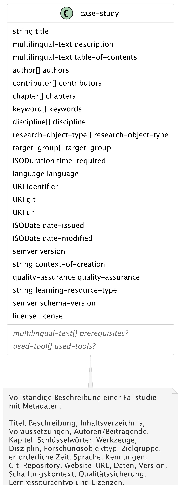

## Chapter

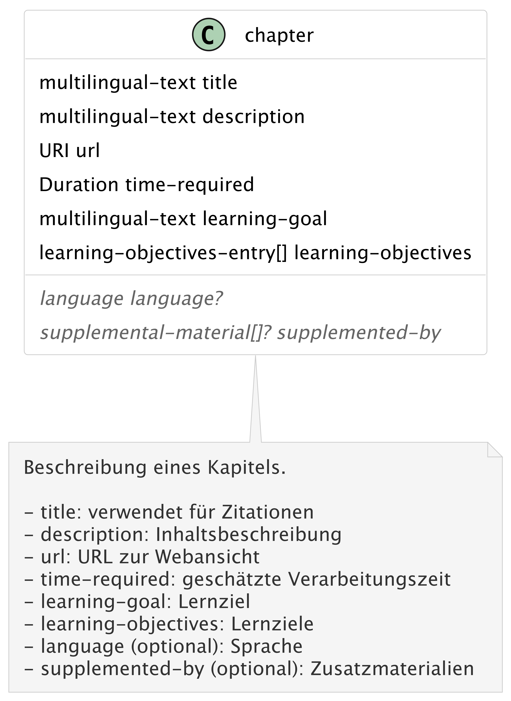

## Learning objectives

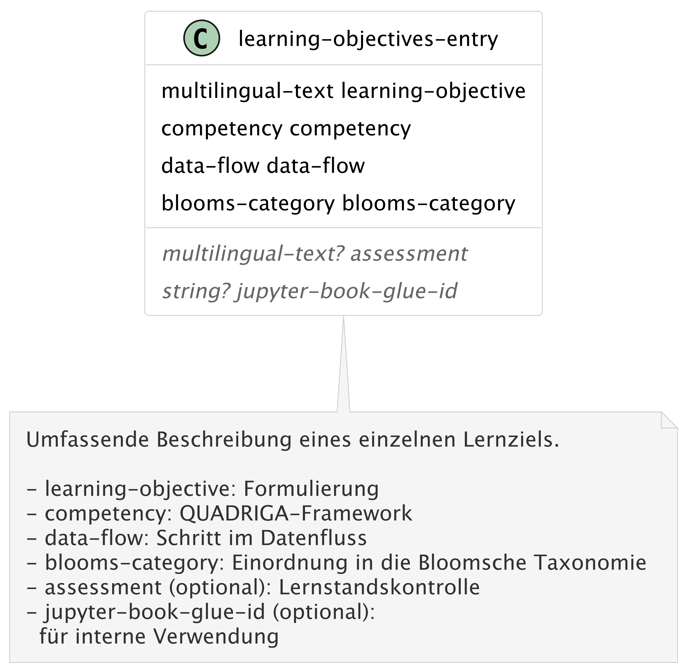

## People

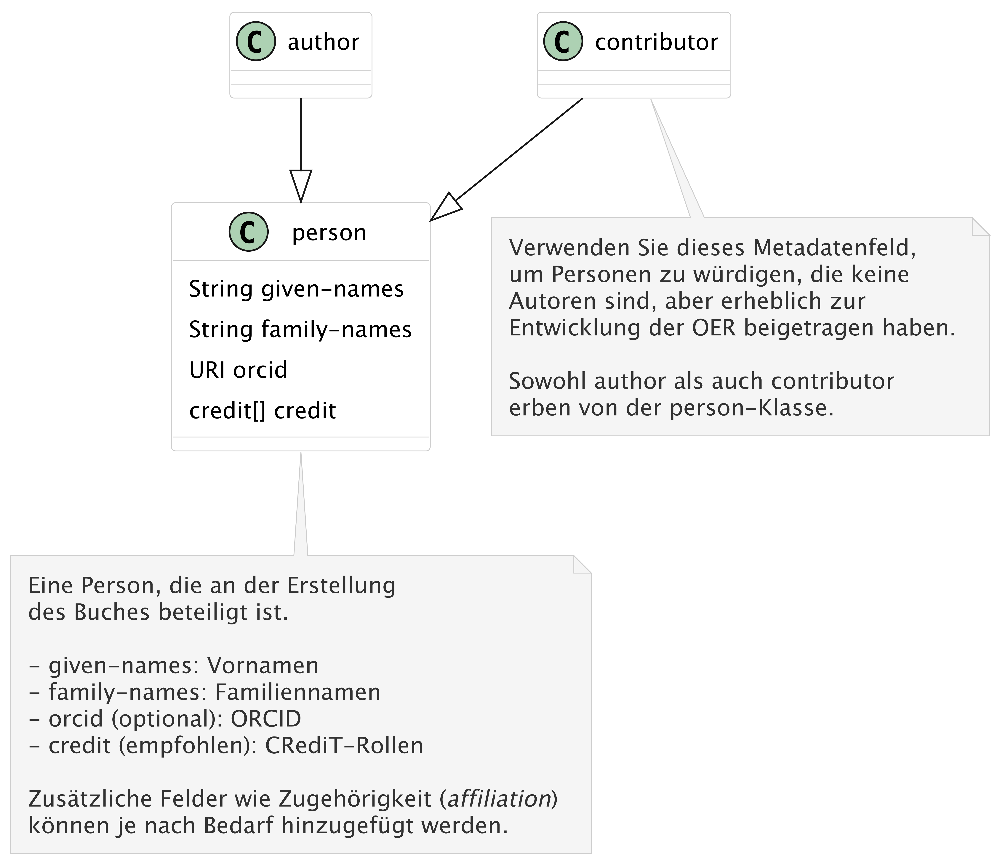

## Literal values for describing a learning objective

**Competency**
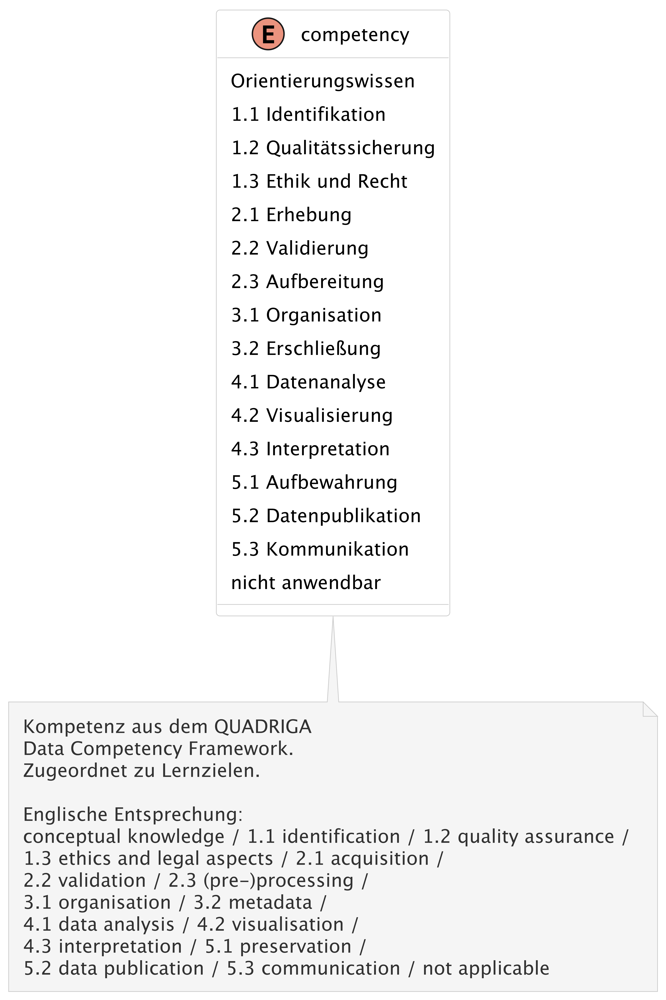
**Blooms taxonomy**
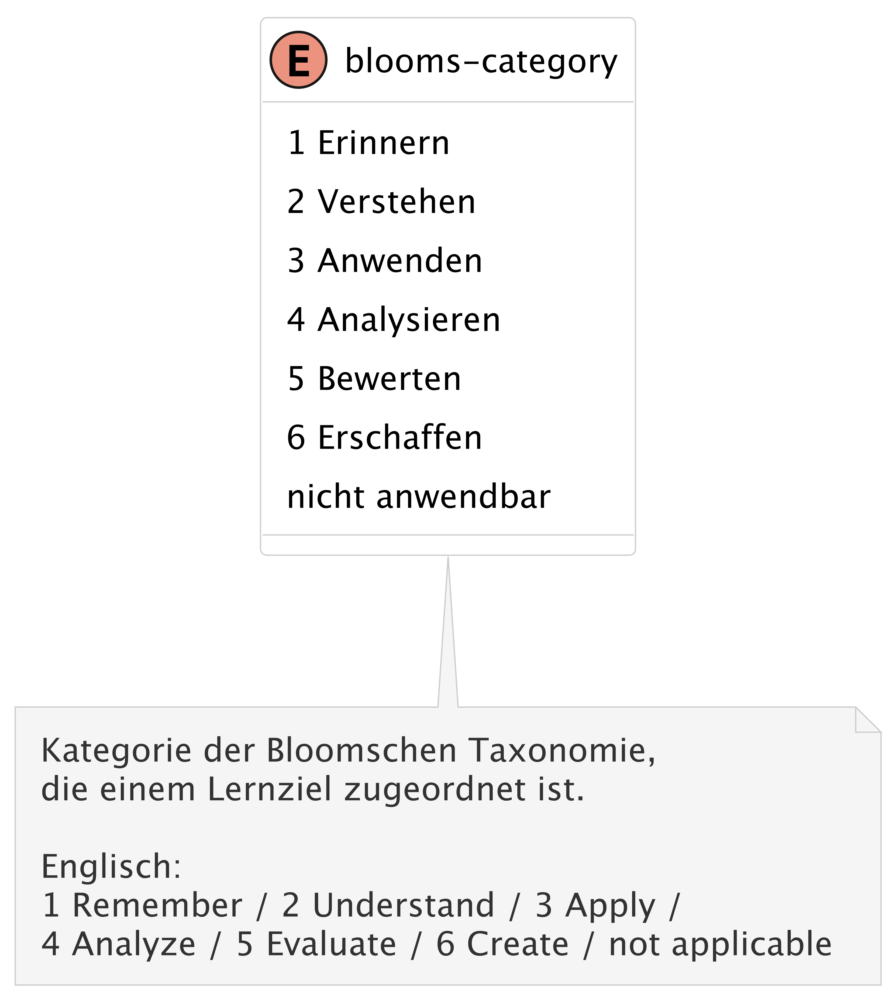
**Data flow**
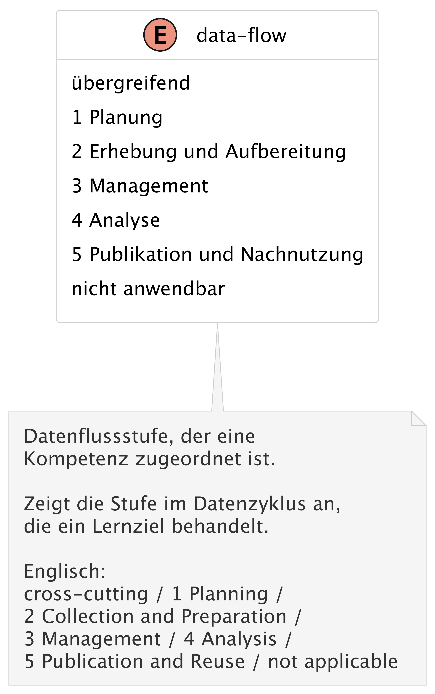

## Multilingual text

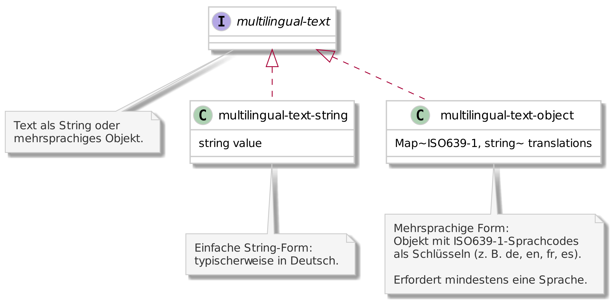

## Other entities / properties

**Keyword**
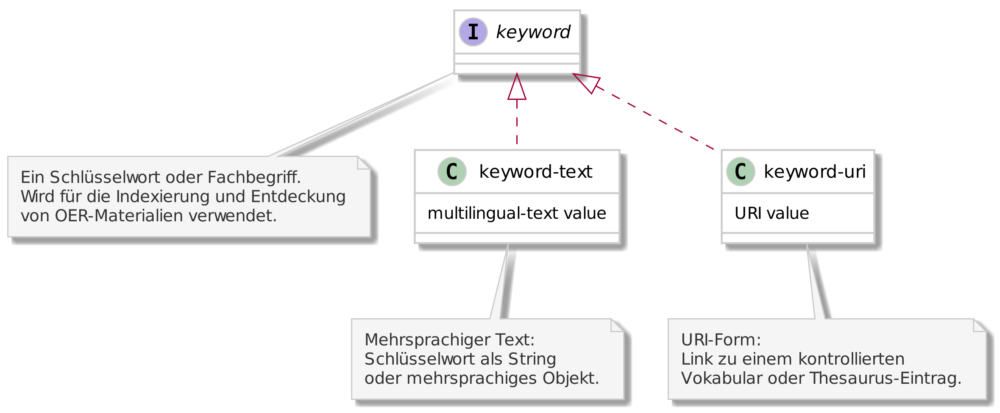

**License**
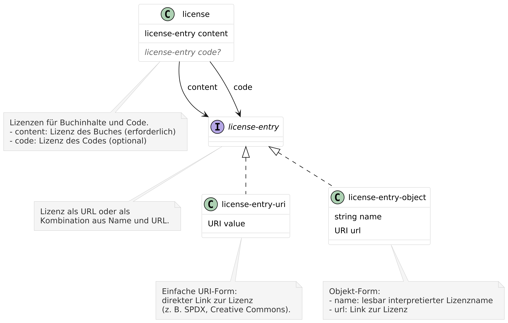

**Quality assurance**
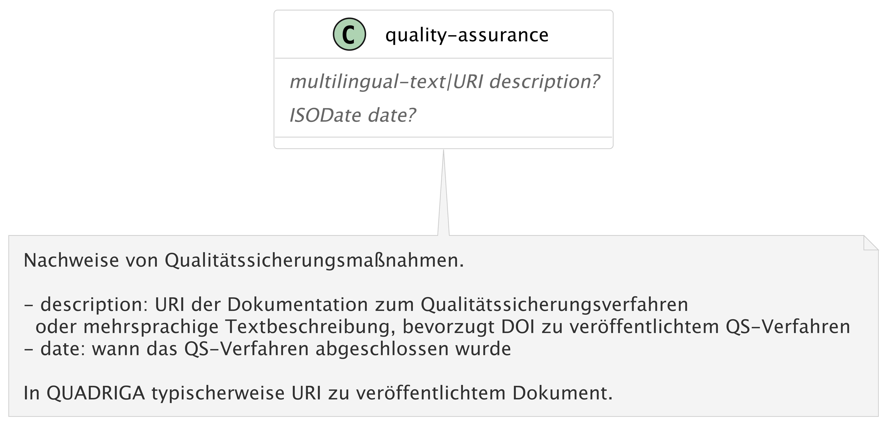

**Supplemental material**
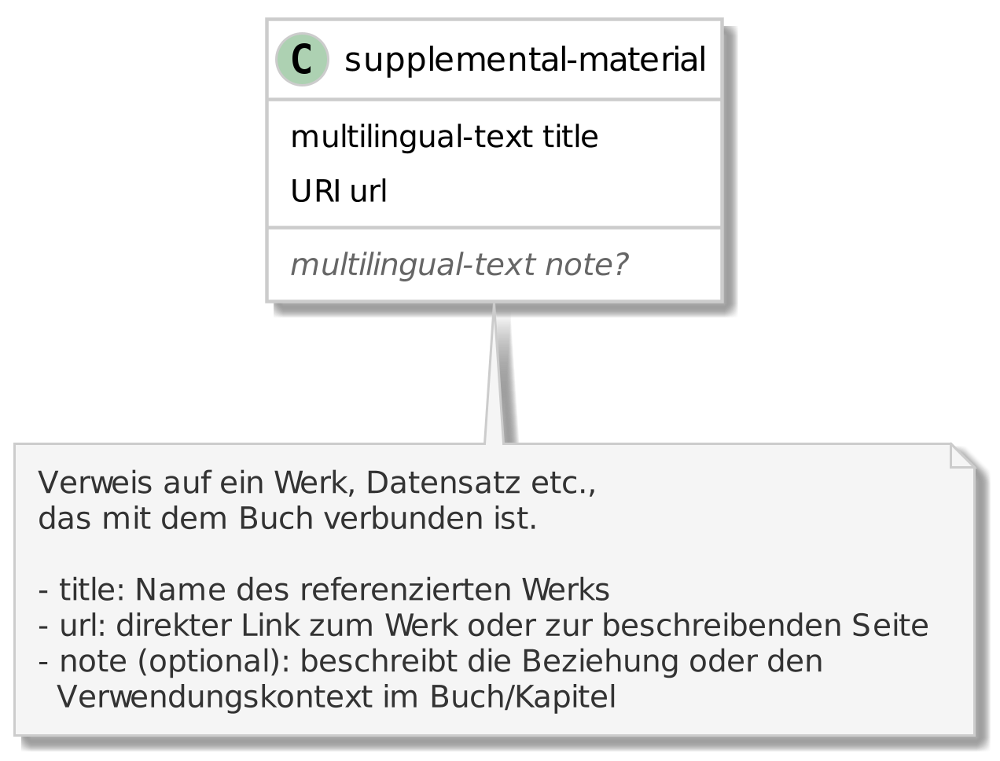

**Used tool**
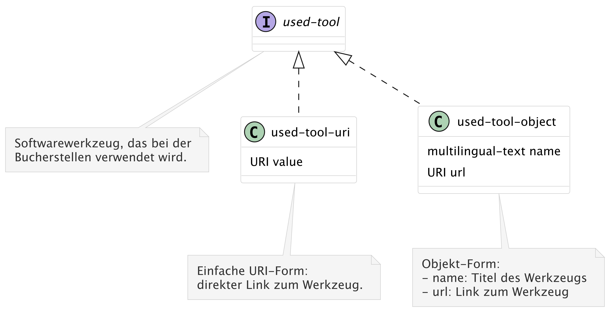
